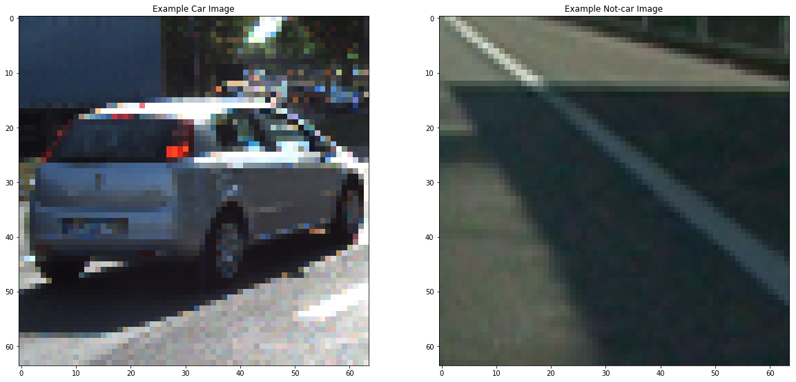
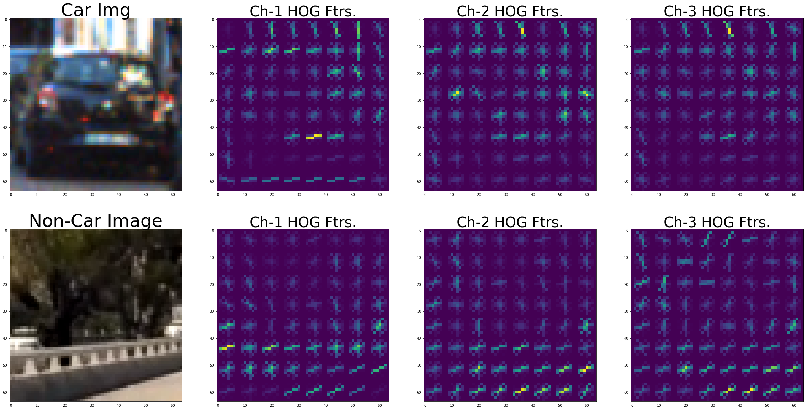
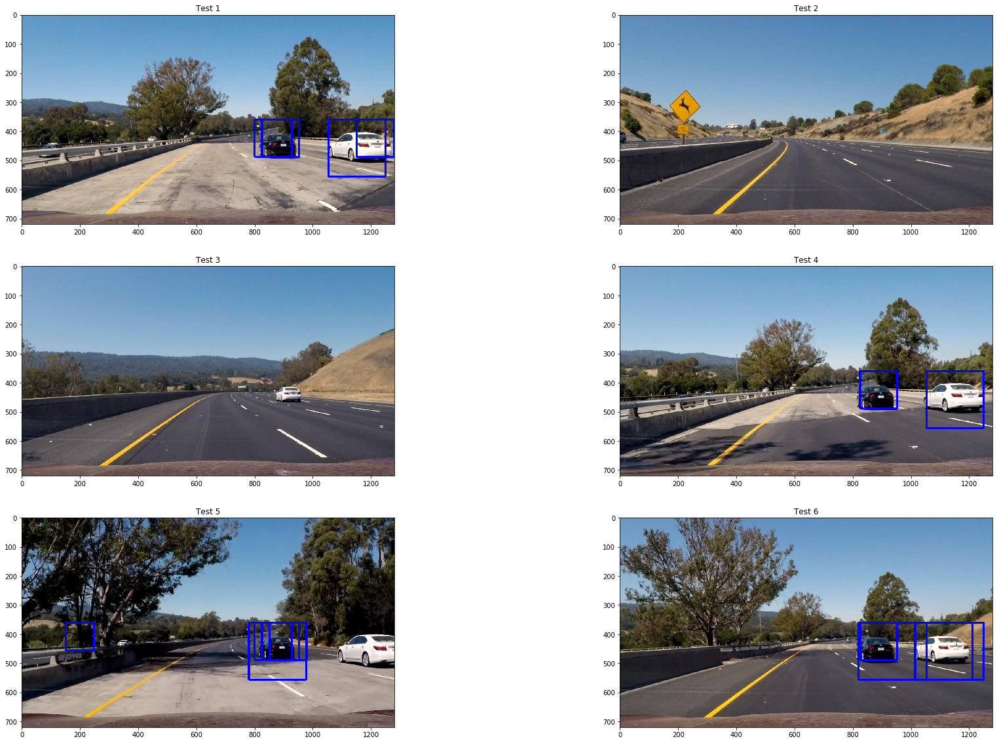
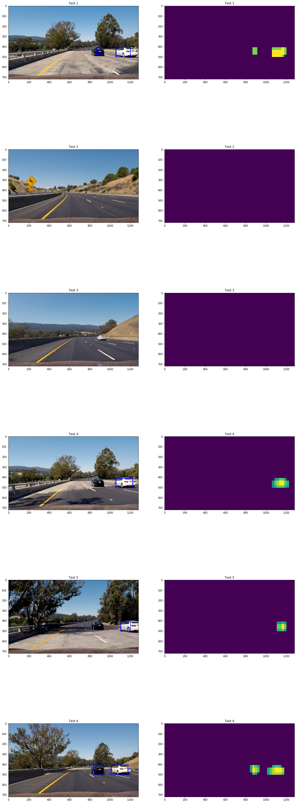

** Vehicle Detection Project**

The goals / steps of this project are the following:

* Perform a Histogram of Oriented Gradients (HOG) feature extraction on a labeled training set of images and train a classifier Linear SVM classifier
* Apply a color transform and append binned color features, as well as histograms of color, to your HOG feature vector. 
* Note: for those first two steps don't forget to normalize your features and randomize a selection for training and testing.
* Implement a sliding-window technique and use your trained classifier to search for vehicles in images.
* Run your pipeline on a video stream (start with the test_video.mp4 and later implement on full project_video.mp4) and create a heat map of recurring detections frame by frame to reject outliers and follow detected vehicles.
* Estimate a bounding box for vehicles detected.

---
### Data
The paths of all vehicle and non-vehicle images have been parsed in `load_data()`

There are a total of 8968 non-vehicle and 8792 vehicle images that were downloaded from [here](https://s3.amazonaws.com/udacity-sdc/Vehicle_Tracking/non-vehicles.zip) and [here](https://s3.amazonaws.com/udacity-sdc/Vehicle_Tracking/vehicles.zip), respectively. Here are two random vehicle and non-vehicle images from the data

  

### Histogram of Oriented Gradients (HOG)

I use the function `get_hog_features()` in the project's notebook to extract the Histogram of Oriented Gradients (HOG) features. 
After reading the images, I explored different color spaces and different `skimage.hog()` parameters (`orientations`, `pixels_per_cell`, and `cells_per_block`).  I grabbed random images from each of the two classes (vehicle & non-vehicle) and displayed them to get a feel for what the `skimage.hog()` output looks like.

Here is an example using the `YCrCb` color space and HOG parameters of `orientations=9`, `pixels_per_cell=(8, 8)` and `cells_per_block=(2, 2)`:

  

I tried various combinations of parameters and I chose the one that has the best classification accuracy when I used HOG features to train the SVM classifier and also the combination that led to the best vehicle detection performance on the videos provided in this project [test_video.mp4](./images_and_videos/test_video.mp4) and [project_video.mp4](./images_and_videos/project_video.mp4).

### Color Histogram and Spatial-based features

In addition to HOG features, I also extract color-histogram and spatial-based features for every vehicle and non-vehicle image. I use these to further improve the classifier's accuracy and robustness. I use the functions `bin_spatial()` with size of 32X32 pixels for each channel to extract the (32*32*3=) 3072 spatial features. The function `color_hist()` computes (32*3=) 96 features of color frequencies.

#### Training an SVM classifier
After parsing the paths of all vehicle and non-vehicle images, and extracting their (HOG, color histogram, and spatial-based) features, I normalize the features and fit them to the classes of the images (vehicle vs. non-vehicle) using Linear SVM. On an out-of-sample (20%) test set, the accuracy of the model, that we call `svc`, is about 98%.

### Sliding Window Search

I have two functions in my code that perfrom Sliding Window Search. The first is `search_windows()` which iterates through windows generated by the function `slide_window()` and predicts whether or not the current window contains a vehicle using the classifier `svc`. The function `slide_window` takes in the area of interest to search, the scale, and the overlap between windows. I searched the bottom half of each image, with scales of 64, 96, 128, & 196 pixels, and an overlap of as much as 0.8. The area of interest is scale dependent. Vertically, the y-axis ranges from `height/2` to `scale+height/2`. The following is the result of `search_windows()` when I applied on six highway images:

  

The second function that performs Sliding Window Search is `find_cars()`. In this function, the HOG features are extracted once for the entire image instead for each sub-image (window) performed in the function `search_windows()`. The HOG feature for each window are simply sampled from the larger HOG feature array.  

I searched on several scales using YCrCb 3-channel HOG features plus spatially binned color and histograms of color in the feature vector, which resulted in good car detection on the test images above and [videos](./images_and_videos/project_video.mp4). 

---

### Video Implementation

#### Output video

Here's a [link to my video result](./images_and_videos/project_video_detected.mp4)

#### Filtering false positives and combining overlapping bounding boxes.

I recorded the positions of positive detections in each frame of the video.  From the positive detections I created a heatmap and then thresholded that map to identify vehicle positions.  I then used `scipy.ndimage.measurements.label()` to identify individual blobs in the heatmap.  I then assumed each blob corresponded to a vehicle.  I constructed bounding boxes to cover the area of each blob detected. 

Here's an example result showing the heatmaps from six test images, the result of `scipy.ndimage.measurements.label()` and the bounding boxes then overlaid on each image:

  

---

### Discussion

The vehicle detection accuracy could be further improved by tuning the parameters of the Search-Window algorithm such as the *scale*, *ystart*, and *ystop*. Additionally, the stability of detection could be increased by projecting the locations of windows in the next video frame(s) based on the current and past frames.  

